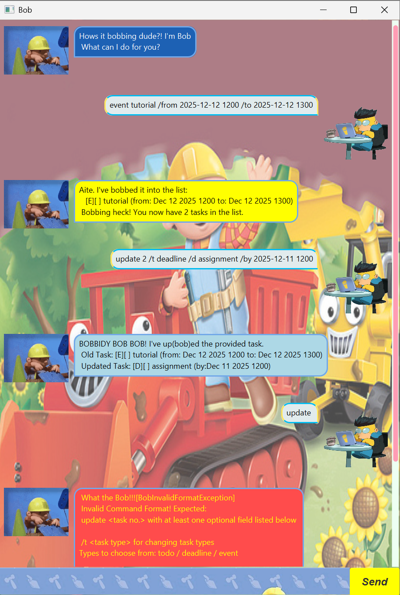

# Bob User Guide


Bob is a builderful tool designed to help users manage their tasks efficiently. 

Made With an intuitive interface & robust features, Bob makes building and managing task a breeze.

## Feature Overview
- [Adding Tasks](#adding-tasks)
  - [To-Do Task](#to-do-task)
  - [Deadline Task](#deadline-task)
  - [Event Task](#event-task)
- [List Task(s)](#list-tasks)
- [Find Task(s)](#find-tasks)
- [Mark Task](#mark-task)
- [Unmark Task](#unmark-task)
- [Delete Task](#delete-task)
- [Update Task](#update-task)
- [Bye (Save and Exit)](#bye-save-and-exit)
- [Miscellaneous](#miscellaneous)
  - [Reply Colour](#reply-colour)
  - [Error Messages](#error-messages)

## Adding Tasks
### To-Do Task
Users can add deadline task using the `deadline` command followed by the task description and the due date.

Command: `todo <desc>`
- Creates a to-do task with the specified description.

Example: `todo read book`

```
Aite. I've bobbed it into the list:
  [T][ ] read book
Now you have 2 task in the list.
```
### Deadline Task

Users can add deadline task using the `deadline` command followed by the task description and the due date.

Command: `deadline <desc> /by <date>`
- Creates a deadline task with the specified description and due date.
- Dates should be in the format `YYYY-MM-DD HHMM`.

Example: `deadline return book /by 2024-10-01 1800`
```
Aite. I've bobbed it into the list:
  [D][ ] return book (by: Oct 1 2024 6:00 PM)
Now you have 3 tasks in the list.
```

### Event Task
Users can add event task using the `event` command followed by the task description, from and to dates.

Command: `event <desc> /from <date> /to <date>`
- Creates an event task with the specified description, from date, and to date.
- Dates should be in the format `YYYY-MM-DD HHMM`.

Example: `event project meeting /from 2024-11-01 1400 /to 2024-11-01 1600`
```
Aite. I've bobbed it into the list:
  [E][ ] project meeting (from: Nov 1 2024 2:00 PM to: Nov 1 2024 4:00 PM)
Now you have 4 tasks in the list.
```


## List Task(s)
Users can view all their tasks using the `list` command.

Command: `list`
- Displays all tasks with their status and details.

Example: `list`
```
  The list do be Bobbing my dude!
    1.[T][ ] homework
    2.[T][ ] read book
    3.[D][ ] return book (by: Oct 1 2024 6:00 PM)
    4.[E][ ] project meeting (from: Nov 1 2024 2:00 PM to: Nov 1 2024 4:00 PM)
```

## Find Task(s)
Users can search for tasks containing a specific keyword using the `find` command followed by the keyword.

Command: `find <keyword>`
- Displays all tasks that contain the specified keyword in their description.

Example (Success): `find book`
- This command lists all tasks that have the word "book" in their description.

```
 BOB YEA! Here is/are 2 the task(s)
 based on the given description: book
   1.[T][ ] read book
   2.[D][ ] return book (by: Oct 1 2024 6:00 PM)

 I've been a good BOB
```

Example (Failure): `find assignment`
- This command attempts to find tasks with the word "meeting" in their description but finds none.

```
 NOOO BOB! No Bobbing tasks within the list
 matches the description for: assignment
 
 Maybe trying another Bobbing description!
```

## Mark Task
Users can mark a task as done using the `mark` command followed by the task number.

Command: `mark <task no.>`
- Marks the specified task as done.

Example: `mark 2`
- This command marks the second task in the list as done.

```
 I'm Marking it. I'm Marking it so good!
   [T][X] read book
```

## Unmark Task
Users can unmark a task as not done using the `unmark` command followed by the task number.

Command: `unmark <task no.>`
- Marks the specified task as not done.

Example: `unmark 2`
- This command marks the second task in the list as not done.

```
 You need to BOB mark! BOB for Viltrum!
    [T][ ] read book
```

## Delete Task
Users can delete a task using the `delete` command followed by the task number.

Command: `delete <task no.>`
- Deletes the specified task from the list.

Example: `delete 1`
- This command deletes the first task in the list.

```
Bob: Noted. I've removed this task:
  [T][ ] homework
Now you have 3 tasks in the list.
```

## Update Task
User can update the all details of a task using the `update` command by specifying the task number and updated details.

Users are required to update at least one detail of a task when using the `update` command and can choose from a list of
optional fields to update.

Command: `update <task no.> <updated fields>`

Fields that can be updated include:
- Task Type ([`todo`](#to-do-task) / [`deadline`](#deadline-task) / [`event`](#event-task)): ` /t <task type>`
- Description: ` /d <description>`
- by: `/by <date>` 
  - Required if changing to [`deadline` task](#deadline-task) i.e. `/t deadline`
- From: `/from <date>` 
  - Required if changing to [`event` task](#event-task) i.e. `/t event`
- To: `/to <date>` 
  - Required if changing to [`event` task](#event-task) i.e. `/t event`

Example: `update 1 /t deadline /d return book /by 2024-12-01 1200`
- This command updates the second task to be a deadline task with the description "return book"
with a due date of December 1, 2024 1200H.

```
BOBBIDY BOB BOB! I've up(bob)ed the provided task. 
 Old Task: [T][ ] read book
 New Task: [D][ ] return book (by: Dec 1 2024 12:00 PM)
```

## Bye (Save and Exit)
Users can exit the application and save their tasks using the `bye` command.

Command: `bye`
- Saves the current task list to a file, displays the exit message before exiting the application.

Example: `bye`

```
 Bye have a great time!
```

## Miscellaneous
### Reply Colour
Commands that **EDIT** the task list in any way (add, delete, mark, unmark, update) will have a colored reply.
- add [yellow] 
- delete [red]
- mark [green]
- unmark [orange]
- update [blue]

Error messages will be coloured [red].

Other commands that **DO NOT** edit the task list will have a standard reply.

### Error Messages
Depending on the type of error, Bob will reply with different error messages to help users understand what went wrong.

There are 3 types of error messages:
1. **BobException**: For errors related to invalid commands or Invalid Task Number.
   - Example: `reorder`
   
       ```
        What the BOB!!![BobException]
          Invalid Command!
       ```
   - Example: `mark 10` (when there are only 5 tasks in the list)

     ```
     What the BOB!!![BobException]
       Task number 10 does not exist!
     ```
     
   - Example: `delete ten`
   
     ```
     What the BOB!!![BobException]
       Invalid Task Number!
     ```
2. **BobInvalidFormatException**: For errors related to invalid/missing format or fields in commands.
   - Example: `deadline return book`
   
     ```
      What the BOB!!![BobInvalidFormatException]
      Invalid Command Format! Expected format: deadline <desc> /by <date>
     ```
     
   - Example: `deadline return book /by tomorrow`
   
     ```
      What the BOB!!![BobInvalidFormatException]
      Invalid Command Format! Expected: YYYY-MM-DD HHMM
     ```
   
3. **BobDateTimeException**: For errors related to invalid date/time logical errors with dates.
   - Example: `event exam /from 2025-12-12 1400 /to 2025-12-12 1200`
   
     ```
      What the BOB!!![BobDateTimeException]
      To Date needs to be after From Date!
     ```